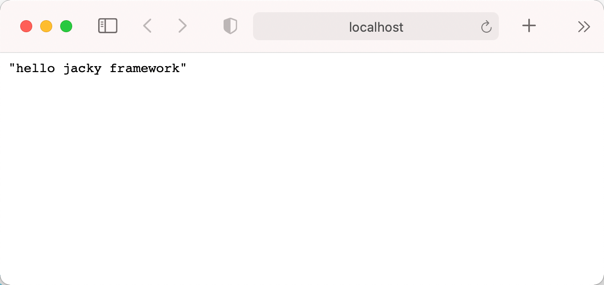

# Mini MVC Framework

这是一个基于mvc模式的轻量java web框架，实现了基本的IOC、AOP等功能。
使用方法如下：
1. 引入maven依赖。
```xml
<repositories>
    <repository>
        <id>jitpack.io</id>
        <url>https://jitpack.io</url>
    </repository>
</repositories>
```
```xml
<dependency>
    <groupId>com.github.cloris-cc</groupId>
    <artifactId>mini-mvc-framework</artifactId>
    <version>1.0.0</version>
</dependency>
```
2. 在resources目录下创建`smart.properties`配置文件。
```properties
#smart.framework.jdbc.driver=com.mysql.jdbc.Driver
#smart.framework.jdbc.url=jdbc:mysql://localhost:3306/demo
#smart.framework.jdbc.username=root
#smart.framework.jdbc.password=123456
smart.framework.app.base_package=cn.teamwang.test # 扫描Bean的基本包路径
```
3. 配置并编写测试类。
```java
package cn.teamwang.test;

import cn.teamwang.framework.annotation.Controller;
import cn.teamwang.framework.annotation.RequestMapping;
import cn.teamwang.framework.bean.ResponseData;

@Controller
public class TestController {

    @RequestMapping("get:/test")
    public ResponseData test() {
        return new ResponseData("hello jacky framework");
    }
}
```
4. 项目打包后将war包部署在tomcat容器中启动即可。
